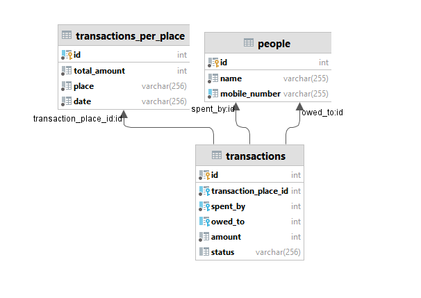

# splitwise

## Introduction:
Simple Splitwise Rest Apis in Go. Using Iris and Mysql Server.
Frontend using React

## Backend Steps:
1. `go mod download`
2. `go run .`

## Backend DB Connection
1. Address: 127.0.0.1:3306
2. User: root
3. Password: root
4. dbName: splitwise

## Frontend
1. `cd frontend/splitwise-frontend`
2. `npm install`
3. `npm start`

## DB Structure

